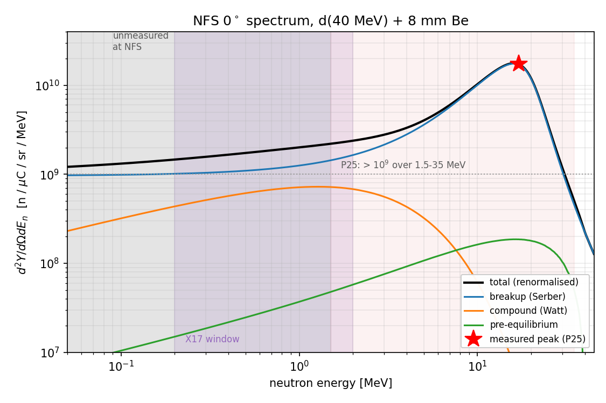

# GANIL / SPIRAL-2 — Neutrons For Science (NFS): beam reference

**Compiled:** 2026-09-10 · for the X17 facility-search study (`docs/PLAN_GANIL_NFS.md`, Part 5)

Everything I could find in the open literature on the NFS neutron beam, tabulated
so a simulation can be built against it. Each number carries its source and the
conditions it was measured under. Where a number is a *model* rather than a
measurement, it says so.

**Read §7 first if you only care about the go/no-go.** The physics wants
E_n ≲ 2 MeV, and that is precisely the part of the NFS spectrum that has never
been measured.

Contents:

- [1. Facility at a glance](#1-facility-at-a-glance)
- [2. Primary beam](#2-primary-beam)
- [3. Converters](#3-converters)
- [4. Collimation, geometry, beam profile](#4-collimation-geometry-and-beam-profile)
- [5. Neutron spectra](#5-neutron-spectra)
- [6. Time structure, TOF, resolution](#6-time-structure-tof-and-energy-resolution)
- [7. The sub-2-MeV problem](#7-the-sub-2-mev-problem-and-the-alternatives)
- [8. Backgrounds](#8-backgrounds)
- [9. Rates for our geometry](#9-rates-for-our-geometry)
- [10. What the literature does not pin down](#10-what-the-literature-does-not-pin-down)
- [11. Files and sources](#11-files-in-this-directory)

---

## 1. Facility at a glance

| quantity | value | source |
|---|---|---|
| Location | GANIL, Caen; SPIRAL-2 experimental area, 9.5 m below grade | L21 |
| Converter room → TOF hall wall | 3 m concrete, pierced by the collimator | L21, P25 |
| TOF hall | 28 m long × 6 m wide (GANIL's own page says 30 m) | P25, G24 |
| Usable flight paths | 5 – 30 m; several experiments can run simultaneously along it | L21 |
| Neutron energy range | ~1 (design goal 0.1) – 40 MeV continuous; 5 – 30 MeV quasi-monoenergetic | L21, G24 |
| First neutron beam | September 2020; scientific exploitation from 2021 | I24 |
| Scientific coordinator | X. Ledoux (xavier.ledoux@ganil.fr) | G24 |
| Auxiliary | irradiation station in the converter cave + pneumatic transfer (45 s), HPGe in TOF hall, FASTER DAQ | L21 |

Note the 28 vs 30 m discrepancy: the refereed papers (L21, P25) both say 28 m;
GANIL's web page and outreach material say 30 m. Use 28 m.

---

## 2. Primary beam

| quantity | value | source |
|---|---|---|
| Accelerator | SPIRAL-2 superconducting LINAC, 26 cavities | L21 |
| RF frequency | 88 MHz (bunch spacing 11.4 ns) | L21 |
| Protons | 0.75 – 33 MeV (design 40 MeV) | G24, L21 |
| Deuterons | 0.75 MeV/u – 20 MeV/u, i.e. 1.5 – 40 MeV | G24 |
| Alphas / heavy ions | 0.75 – 20 MeV/u / up to 14 MeV/u | G24, L21 |
| LINAC max current | 5 mA CW (3.12×10¹⁶ p or d/s) | L21 |
| Max current at NFS | **50 µA** = 3.12×10¹⁴ /s, set by the bunch selector and by radioprotection/thermal limits for 40 MeV d + 8 mm Be | L21 |
| Bunch selector | 1 bunch in N, downstream of the RFQ; N ≥ 100 required at NFS, hardware supports 10 < N < 10 000 | L21, S20 |
| Bunch selector mechanism | static dipole deflects onto a 7.3 kW scraper; two HV travelling-wave pulses (≤2.5 kV, ≤6 ns rise) keep the selected bunch on axis | S20 |
| Bunch width | design target 0.5 ns FWHM, 1 ns the accepted upper limit; measured shorter than the 80 ps electronic resolution | S20, L21 |
| Achievable repetition rates | 8.8 kHz – 8.8 MHz; **rates actually run: 22 kHz, 440 kHz, ~1 MHz** | L21, P25, M25 |

⚠ **Inconsistency in L21.** The commissioning paper states "the beam frequency was
set to 22 kHz (N=400)". 88 MHz / 400 = 220 kHz, not 22 kHz — one of the two is a
typo. The 2025 PS-PPAC campaign unambiguously used 440 kHz (N = 200), and Medley
used ≈1 MHz. `docs/PLAN_GANIL_NFS.md` §5.2/§5.4 currently quotes "22 kHz,
45 µs period" as *the* NFS rate; that is one historical setting at most and
should be replaced by the table in §6 below — the choice of rate is ours to make
and it is the single most important beam parameter for us (see §6.2).

---

## 3. Converters

Three converters on a water-cooled holder; the two thin ones sit 40.8 cm
downstream of the rotating one.

| converter | spec | use | source |
|---|---|---|---|
| Thick ⁹Be, rotating | 8 mm thick, 170 mm diameter, 2000 rpm, sustains 2 kW | **continuous white spectrum**, d + Be | L21, G24 |
| Thin ⁹Be, fixed | 0.5 mm (1–3 mm range quoted elsewhere) | quasi-monoenergetic p + Be | L21, G24 |
| Thin ⁷Li, fixed | 1.5 mm | quasi-monoenergetic ⁷Li(p,n)⁷Be | L21 |

Derived / cross-checked:

| quantity | value | note |
|---|---|---|
| Range of 40 MeV d in Be | **5.6 mm** (this repo, Bethe CSDA) | 8 mm converter fully stops the beam |
| Range of 31.9 MeV p in Be | 6.45 mm (L21) | same conclusion |
| Deuteron transmission through the thick target | ~85–90 % survive as beam-like (only ~10–15 % react) | M23 Fig. 4 |
| Energy loss, 31.9 MeV p in 1.5 mm Li / 0.5 mm Be | 1.24 / 1.37 MeV | L21 — sets the QME peak width |
| Max current, thin Li / thin Be | 20 / 50 µA (melting points 180 / 1287 °C) | L21 |

---

## 4. Collimation, geometry and beam profile

| quantity | value | source |
|---|---|---|
| Collimator | inside the 3 m wall, conical bore, layered concrete / borated polyethylene / iron / lead | L21 |
| Collimator aperture used in 2025 | **25.55 mm diameter** | P25 |
| Angular aperture | 3.8×10⁻³ rad | L21 |
| Collimator exit → converter | **435.3 cm** (derived: 740.6 − 305.3) | P25 |
| Spot radius at collimator exit | ~1.7 cm | L21 |
| Spot radius at far end of hall (28 m) | ~13 cm | L21 |
| Second collimator, mid-hall | reduces spot radius back to ~2 cm | L21, I24 |
| Measured spot diameter at 740.6 cm | **44.4 ± 0.4 mm** | P25 |
| Measured 10–90 % edge fall-off | **4.9 ± 0.4 mm** | P25 |
| Measured divergence (half-angle) | **3.08 ± 0.07 mrad** | P25 |
| Beam solid angle at 740.6 cm | (28.2 ± 0.5)×10⁻⁶ sr | P25 |

**The converter behaves as a point source.** Projecting the 25.55 mm aperture
from a point at the converter through the measured geometry gives 43.5 mm at
740.6 cm against 44.4 ± 0.4 mm measured — 2 % — so a simple pinhole projection is
good enough for a simulation. `nfs_beam.beam_diameter_cm()` implements it:

| distance from converter | spot diameter (25.55 mm collimator) | on-axis flux vs 5 m |
|---|---|---|
| 5 m | 2.9 cm | 1.00 |
| 7.41 m (2025 PPAC position) | 4.4 cm | 0.46 |
| 10 m | 5.9 cm | 0.25 |
| 13.6 m | 8.0 cm | 0.14 |
| 20 m | 11.7 cm | 0.063 |
| 28 m | 16.4 cm | 0.032 |

The 8 cm spot the cell design is aimed at (`PLAN` §4.1) sits at **≈13.6 m** with
the 25.55 mm collimator — or much closer with a wider aperture, if one exists.
This is question Q1 in §10.

The sharp 4.9 mm edge is worth emphasising: the beam is essentially a flat-top
cylinder with a ~1 cm penumbra, so a 40 cm long cell is uniformly illuminated
along the axis and cleanly bounded transversely. For a simulation, a uniform
disc convolved with a ~2 mm σ Gaussian reproduces the measured profile.

---

## 5. Neutron spectra

### 5.1 d(40 MeV) + thick Be — the workhorse

This is the reference reaction and the one to simulate. The only published
*absolute, differential* measurement of the NFS beam itself is P25.

| quantity | value | source |
|---|---|---|
| Spectrum shape | continuous, broad breakup bump | P25 |
| **Peak** | **(17.3 ± 0.5)×10⁹ n/µC/sr/MeV at E_n = 17 MeV** | P25 |
| Above 10⁹ n/µC/sr/MeV | 1.5 – 35 MeV | P25 |
| Above 10⁸ n/µC/sr/MeV | 1.5 – 42 MeV | P25 |
| Reported range | 1.5 – 44 MeV; **non-zero above the 40 MeV beam energy** (positive-Q channels) | P25 |
| Mean energy at 0° | ≈14 MeV | G24, L21 |
| Total 4π yield | 1.8×10¹³ n/s at 50 µA = **0.058 n per deuteron** | L21 |
| Flux near the converter | ~10¹¹ n/cm²/s (2×10¹⁰ per GANIL's page) | L21, G24 |
| Average flux, TOF hall, short flight path | ~10⁸ n/cm²/s, peaking at 5×10⁶ n/cm²/MeV/s near 14 MeV, at 50 µA | L21 |
| Independent cross-check | Medley (H(n,p) recoil telescopes, ≈5 m) agrees with the PS-PPAC flux over **2 – 25 MeV** | M25 |

Measured constraints are collected machine-readably in
[`data/nfs_measured_anchors.csv`](data/nfs_measured_anchors.csv).

### 5.2 A spectrum you can actually evaluate

No one publishes the NFS spectrum as a table. To get a usable differential
source I implemented the **Serber-hybrid thick-target parameterisation** of
Morrell & Bernstein (PRC 108, 024616 (2023); M23) in
[`nfs_beam.py`](nfs_beam.py) and renormalised it to the measured 17 MeV peak.
M23 is the right choice here because it was fitted to exactly this data — thick
Be targets from 16–50 MeV including Saltmarsh's d(40 MeV)+Be, which P25 shows
agrees with the NFS beam.

Model components (all with recommended parameters, c₁…c₆ = 1):

| component | σ(ε_d) [mb] | E distribution | angular distribution |
|---|---|---|---|
| Breakup (stripping) | 57.2 (A^⅓+2^⅓) / (1+e^((22.3−ε_d)/9.4)) | Serber, centred at ½(ε_d−E_c), width w_d = 0.37 E_B = 0.823 MeV | Serber, θ₀ = 0.72 √(E_B/(ε_d−E_c))(1−ε_d/8m_dc²) |
| Compound | 80.6 [e^(−½((18−ε_d)/14)²) + 0.3/(1+e^((18−ε_d)/7))] | Watt, kT = 0.1 + 0.27√(ε_d+Q) | Kalbach–Mann with a → 1.1a |
| Pre-equilibrium | 34.2 / (1+e^((22−ε_d)/6)) | Watt, kT = 0.75 + 0.63√(ε_d+Q) | Kalbach–Mann with a → 1.8a |

with E_B = 2.225 MeV, Q = 4.36 MeV, E_c = 1.38 MeV for Be. Thick-target yield is
the integral over the deuteron slowing-down weighted by the transmission factor
τ (M23 Eq. 16). My τ = 0.95 over the full slowing-down; M23's Fig. 4 implies
~0.86 at 40 MeV, so my σ_T is somewhat low. A ≤10 % effect, absorbed entirely by
the renormalisation below.

**θ₀ = 9.9° at ε_d = 40 MeV.** Our collimator subtends 3.08 mrad = 0.18°, so the
beam is carved out of the flat top of the emission cone — the angular
distribution is constant to <0.1 % across the beam and can be ignored entirely
in a simulation. Only the 0° spectrum matters.

Output, renormalised (**model → data factor 1.293**, i.e. the parameterisation
is 23 % low in absolute terms), in
[`data/nfs_dbe40_0deg_model.csv`](data/nfs_dbe40_0deg_model.csv):

| E_n [MeV] | total | breakup | compound | pre-eq | breakup fraction |
|---|---|---|---|---|---|
| 0.1 | 1.32e9 | 9.87e8 | 3.20e8 | 1.04e7 | 0.75 |
| 0.2 | 1.46e9 | 1.01e9 | 4.36e8 | 1.50e7 | 0.69 |
| 0.5 | 1.74e9 | 1.10e9 | 6.14e8 | 2.46e7 | 0.63 |
| 1.0 | 2.01e9 | 1.25e9 | 7.15e8 | 3.70e7 | 0.63 |
| 1.5 | 2.20e9 | 1.44e9 | 7.20e8 | 4.77e7 | 0.65 |
| 2.0 | 2.38e9 | 1.64e9 | 6.82e8 | 5.76e7 | 0.69 |
| 3.0 | 2.79e9 | 2.15e9 | 5.59e8 | 7.56e7 | 0.77 |
| 5.0 | 4.03e9 | 3.60e9 | 3.23e8 | 1.07e8 | 0.89 |
| 8.0 | 7.29e9 | 7.02e9 | 1.22e8 | 1.44e8 | 0.96 |
| 10.0 | 1.03e10 | 1.01e10 | 6.11e7 | 1.63e8 | 0.98 |
| 14.0 | 1.65e10 | 1.63e10 | 1.46e7 | 1.83e8 | 0.99 |
| **17.0** | **1.73e10** | 1.71e10 | 4.91e6 | 1.86e8 | 0.99 |
| 20.0 | 1.20e10 | 1.18e10 | 1.63e6 | 1.79e8 | 0.98 |
| 25.0 | 3.50e9 | 3.35e9 | 2.49e5 | 1.50e8 | 0.96 |
| 30.0 | 1.17e9 | 1.07e9 | 3.47e4 | 1.04e8 | 0.91 |
| 35.0 | 4.96e8 | 4.46e8 | 3.70e3 | 4.98e7 | 0.90 |
| 40.0 | 2.26e8 | 2.24e8 | 30 | 1.67e6 | 0.99 |

units n/µC/sr/MeV.

### 5.3 How much to trust it

Validated:

| test | model | measurement | verdict |
|---|---|---|---|
| Peak position | 15.9 MeV | 17.0 MeV | 1 MeV low, shape slightly soft |
| Peak height | anchored | 17.3e9 | by construction |
| > 10⁹ over 1.5–35 MeV | fails above ~30 MeV (5.1e8 at 35 MeV) | holds to 35 MeV | **model tail too soft** |
| Flux at 5 m, 50 µA, all E | 5.0×10⁷ n/cm²/s | "close to 10⁸" | factor ~2, consistent with the soft tail |
| Flux at 5 m, 50 µA, near 14 MeV | 3.3×10⁶ n/cm²/MeV/s | 5×10⁶ | 1.5× low, same cause |
| 4π integral | 0.017 n/d | 0.058 n/d | **factor 3.4 — do not use this model for 4π normalisation** |
| Spot geometry | 43.5 mm at 740.6 cm | 44.4 ± 0.4 mm | 2 %, good |

Read that as: **the 0° shape between ~2 and ~25 MeV is good to tens of percent
after renormalisation; the high-energy tail is too soft; the 4π normalisation is
wrong; and below 1.5 MeV nothing is validated at all.** The 4π discrepancy
probably lives in my Kalbach angular implementation being too forward-peaked,
which does not affect the 0° numbers we use — but it is unresolved, so the
model's job is shape at 0°, nothing else.

**The sub-MeV extrapolation is the weak point and it is the region we want.**
Below ~1.5 MeV the model's yield is 60–75 % *breakup*, which is physically
implausible — evaporation should dominate there. What is happening is that the
Serber energy distribution has a (E_n − ε_d/2)⁻³ tail that the model was never
fitted against at E_n ≪ ε_d/2 (Harrig's 16 MeV data are the only low-E_n
constraint in M23's fit). Treat the compound column as a **lower bound** on the
sub-MeV yield and the total as a soft upper bound. That is roughly a factor 3–4
band: 3.2×10⁸ – 1.3×10⁹ n/µC/sr/MeV at 100 keV.

### 5.4 Quasi-monoenergetic p + thin converter

Measured during commissioning with 31.9 MeV protons (L21):

| converter | QME peak | peak fraction of 0° neutrons | 0° yield above 27 MeV | flux at 5 m |
|---|---|---|---|---|
| ⁷Li 1.5 mm | 29.7 MeV | 49 % | (1.77 ± 0.21)×10⁹ n/sr/µC | 1.42×10⁵ n/cm²/s (20 µA) |
| ⁹Be 0.5 mm | 29.5 MeV + bump at 26.9 MeV | 32 % | (1.61 ± 0.19)×10⁹ n/sr/µC | 3.22×10⁵ n/cm²/s (50 µA) |
| ⁹Be 8 mm (thick, protons) | continuum | — | (29.4 ± 4.7)×10⁹ n/sr/µC above 2 MeV | 5.88×10⁶ n/cm²/s (50 µA) |

Reactions: ⁷Li(p,n)⁷Be, Q = −1.644 MeV, the g.s. and 0.423 MeV state unresolved
because proton straggling in the converter exceeds 1.2 MeV; ⁹Be(p,n)⁹B,
Q = −1.850 MeV, with the 2.345 and 2.780 MeV states making the 26.9 MeV bump.
GANIL quotes the QME peak as tunable **between 5 and 30 MeV** with a maximum TOF
hall flux of 2×10⁵ n/s/cm². All of these carry a low-energy continuum tail.

Yield uncertainties: 12 % for thin converters, 16 % for thick, dominated by the
charge measurement (10 % / 15 %).

---

## 6. Time structure, TOF and energy resolution

### 6.1 What has been used

| campaign | rate | flight path | current | source |
|---|---|---|---|---|
| 2019/2021 commissioning (protons) | 22 kHz "(N=400)" — see the §2 warning | 15.74 / 15.74 m | 20–80 nA (activation) | L21 |
| 2025 PS-PPAC monitor (d) | 440 kHz (N = 200), period 2.27 µs | 7.406 m | 7.60 ± 0.05 µA | P25 |
| Medley light-ion run (d) | ≈1 MHz | ≈5 m | — | M25 |

### 6.2 Wrap-around — the constraint that decides our run plan

Neutrons slower than the limit below are overtaken by the next bunch and their
TOF is ambiguous. From `nfs_beam.wraparound_limit_MeV()`:

| rate | period | limit @ 5 m | limit @ 7.4 m | limit @ 10 m | limit @ 20 m |
|---|---|---|---|---|---|
| 8.8 MHz | 114 ns | 7.8 MeV | 15.3 MeV | 27.6 MeV | 71.7 MeV |
| 1 MHz | 1.00 µs | 126 keV | 273 keV | 486 keV | 1.84 MeV |
| 440 kHz | 2.27 µs | 25 keV | 54 keV | 96 keV | 382 keV |
| 88 kHz | 11.4 µs | 1.0 keV | 2.2 keV | 3.9 keV | 16 keV |
| 22 kHz | 45.5 µs | 65 eV | 140 eV | 250 eV | 1.0 keV |

**At 440 kHz and ≤10 m we can see down to ~100 keV with no wrap-around.** At
1 MHz and 20 m the limit is 1.8 MeV, which would destroy the measurement we
want. This is a free parameter we choose, and the correct choice is a *low*
rate at a *short* flight path. That the intensity scales with the rate is the
price; at 440 kHz the facility is already running only 1 bunch in 200.

Contrast with n_TOF EAR2, where the >1 ms thermal gate was an analysis in
itself: at NFS there is no wrap-around problem in our energy window at all.

### 6.3 Time of flight and energy resolution

TOF at the 2025 monitor position, and the resolution from
dE/E = γ(γ+1)√((dt/t)² + (dL/L)²) (Ledoux & Ridikas):

| E_n [MeV] | TOF @ 7.4 m [ns] | dE/E @ 7.4 m (1 ns, 1 cm) |
|---|---|---|
| 0.1 | 1692 | 0.30 % |
| 0.2 | 1197 | 0.32 % |
| 0.5 | 757 | 0.38 % |
| 1.0 | 535 | 0.46 % |
| 2.0 | 379 | 0.59 % |
| 5.0 | 240 | 0.88 % |
| 10 | 171 | 1.22 % |
| 17 | 132 | 1.59 % |
| 40 | 87 | 2.46 % |

Measured performance: **80 ps electronic time resolution**, ~1 ns achieved with
an EJ309 detector, giving **better than 0.4 MeV FWHM at 30 MeV** on a 15.74 m
flight path (L21). Design studies promised ~0.5 % over the whole range at 10 m
with the 100 ps LINAG time spread, and <5 % everywhere with 1 ns detectors (R04).
GANIL quotes <1 % with fast detectors, <5 % at 40 MeV with HPGe (G24).

For us this is comfortable: at E_n ≈ 1 MeV, 0.5 % is 5 keV, far finer than the
E\* structure we are resolving. **Neutron energy is not a limiting resolution
anywhere in this measurement** — the opening-angle resolution is.

---

## 7. The sub-2-MeV problem, and the alternatives

The X17 kinematics want E\* near 20.6 MeV, i.e. **E_n ≲ 2 MeV** (`PLAN` §1.2).
Three facts collide:

1. NFS's d+Be spectrum peaks at 17 MeV and is measured only down to 1.5 MeV.
2. Below 1.5 MeV, the spectrum is **unmeasured**, and the only available model
   is unvalidated exactly there (§5.3).
3. The best-guess model yield at 0.2–2 MeV is ~1.5–2.4×10⁹ n/µC/sr/MeV, i.e.
   **8–14 % of the peak value, per MeV** — not the ~1/17 the PLAN §5.1 assumed
   from reading the log plot, but the same order.

So the thin bottom edge is thinner than the peak but not catastrophically so,
*if the model's sub-MeV extrapolation holds*. That "if" is the whole question,
and it cannot be closed from the literature. It needs either the NFS team's own
MCNPX/simulated spectrum below 1.5 MeV, or a measurement.

Options if the d+Be tail is not good enough — in the order I would rank them:

**(a) Lower the deuteron energy.** SPIRAL-2 delivers deuterons from 0.75 MeV/u.
A thick-Be spectrum from, say, 10–15 MeV deuterons is far softer (the breakup
bump sits at ~½ε_d) while still using the high-power rotating converter. This is
the cheapest lever and nobody in the NFS literature discusses it because their
users all want the 14 MeV bump. `nfs_beam.thick_target_yield(e_d0=...)` covers
it directly — worth scanning ε_d as a first calculation.

**(b) D(d,n)³He with a low-energy deuteron beam.** Explicitly named as an NFS
capability (R04 §2.1): "in the low energy range (E_n < 8 MeV) mono-energetic
neutrons can be produced by the ²H(d,n)³He reaction", solid (D-in-Ti, ~1 mg/cm²)
or gas target. At low ε_d this is the classic ~2.45 MeV monoenergetic DD source,
tunable upward with beam energy. **This lands exactly where our physics wants
to be, and it is monoenergetic** — no folding against a continuum, and E\* is
fixed rather than smeared. The catch is flux: a 1 mg/cm² target is thin, the
yield scales with the beam power the target survives, and R04 says "further
studies along these lines are urgently needed", i.e. it may never have been
built. **This is the first thing to ask GANIL about.**

**(c) ⁷Li(p,n)⁷Be near threshold.** Q = −1.644 MeV, threshold 1.881 MeV. With
protons a little above threshold the 0° neutron energy runs from ~30 keV upward
and is kinematically collimated. SPIRAL-2 goes down to 0.75 MeV protons, so the
whole near-threshold region is accessible. GANIL only advertises the QME peak
between 5 and 30 MeV, but nothing forbids the low-energy end. Flux is the issue —
the thin-Li converter caps at 20 µA.

**(d) Moderation.** R04 §2.2 studied a Be + D₂O sandwich moderator giving
~4×10¹¹ n/cm²/s over 3–100 keV at full 5 mA beam power. Far too soft for us
(we want ~1 MeV, not keV) and it destroys the TOF resolution via slowing-down
time, but it demonstrates that the facility has thought about tailoring the
spectrum downward.

**(e) Accept a higher E_n.** The shoulder slides from 109.6° at rest to 99.3° at
2 MeV and 65.7° at 14 MeV (`PLAN` §1.2), into the IPC-rich small-angle region.
This is Q2 in the PLAN's open questions and it is a physics decision, not a
facility one.

---

## 8. Backgrounds

| item | value | source |
|---|---|---|
| Thermal neutron contamination | **≤ (3.85 ± 0.43)×10⁻⁵** of fast, upper limit, in the TOF hall | P25 |
| Collimator design intent | concrete / borated PE / iron / lead layers, conical bore, explicitly to minimise n and γ background in the TOF hall | L21 |
| γ flash | "known to be very penalizing… will probably be strongly reduced at NFS"; M25 calls the γ-flash characteristics "suitable"; used routinely as the TOF t₀ reference | R04, M25 |
| γ peak width | σ ≈ 1 ns, i.e. detector-limited, at 15.74 m | L21 |
| n/γ discrimination | needed — L21 note a residual prompt-γ peak survives PSD in "neutron-identified" events | L21 |
| Beam line | evacuated through the TOF hall to suppress air scattering; a magnet deflects the primary beam to a Faraday cup | L21 |
| TOF-uncorrelated fission background | 1.40×10⁻⁴ of correlated (the measurement behind the thermal limit) | P25 |

The thermal suppression is a genuinely large win for us: at n_TOF the
²⁷Al(n,γ) 7.72 MeV capture line dominated the trigger background, and a
3.9×10⁻⁵ thermal fraction essentially removes it.

Backgrounds *not* characterised anywhere in the literature, which we would have
to simulate or measure ourselves: fast-neutron elastic recoils in the drift gas
and vessel, ³He(n,p)t protons in the cell, (n,xn) and (n,charged) in the vessel
walls, and beam-correlated room background over 28 m of hall.

---

## 9. Rates for our geometry

On-axis differential fluence rate is simply Y(E_n) × I / L², independent of the
collimator aperture (the aperture sets the illuminated *area*, not the on-axis
intensity). From `nfs_beam.fluence_rate()`, using the data-normalised model:

| configuration | total 0.05–45 MeV | 0.2–2 MeV | 1–3 MeV |
|---|---|---|---|
| 5 m, 50 µA | 5.0×10⁷ | 7.3×10⁵ | 9.6×10⁵ |
| 7.41 m, 7.6 µA (2025 conditions) | 3.5×10⁶ | 5.0×10⁴ | 6.6×10⁴ |
| 10 m, 50 µA | 1.3×10⁷ | 1.8×10⁵ | 2.4×10⁵ |
| **13.6 m (8 cm spot), 50 µA** | 6.8×10⁶ | **9.8×10⁴** | 1.3×10⁵ |
| 20 m, 50 µA | 3.1×10⁶ | 4.5×10⁴ | 6.0×10⁴ |

units n/cm²/s. Two things to note against `PLAN` §5.3, which assumed
1.5×10⁶ n/cm²/s over an 8 cm spot:

- That figure was the **whole-spectrum** flux. In the 0.2–2 MeV window we
  actually want, the flux at 13.6 m (the 8 cm-spot distance) and 50 µA is
  **9.8×10⁴ n/cm²/s**, about 15× lower. The X17/day numbers in PLAN §5.3
  should be re-derived from a proper fold, not scaled from the total.
- Every rate scales linearly with the repetition rate we choose. 50 µA is the
  authorised maximum, which corresponds to some particular N; running at a low
  rate to avoid wrap-around (§6.2) may cap the current well below 50 µA. **Ask
  GANIL what current is available at 440 kHz** — this is Q3 in §10 and it moves
  the rate estimate by up to an order of magnitude.

---

## 10. What the literature does not pin down

Questions for the NFS team (X. Ledoux, xavier.ledoux@ganil.fr):

1. **What collimator apertures exist?** Only 25.55 mm is documented. An 8 cm
   spot at 5 m instead of 13.6 m would recover a factor 7.4 in flux.
2. **What is the d+Be spectrum below 1.5 MeV?** They will have an MCNPX or
   Geant4 model of the converter. This single answer decides the study.
3. **What deuteron current is available as a function of repetition rate?** The
   50 µA maximum is quoted without a rate.
4. **Has the D(d,n)³He monoenergetic option ever been implemented?** (R04 §2.1.)
   And can the LINAC actually deliver a few-MeV deuteron beam to NFS?
5. **What is the achievable spot at a given flight path, and can the second
   mid-hall collimator be removed or bypassed?**
6. **Is the γ flash quantified?** Everything published is qualitative.
7. Sanity check on our own arithmetic: is the model's 0.017 n/d 4π yield or
   GANIL's 0.058 n/d the right number for 40 MeV d + 8 mm Be?

Also worth chasing but not blocking: the digitised P25 Fig. 11 (ask the authors
for the table — it is the only real NFS spectrum), Saltmarsh's tabulated
d(40)+Be spectra (NIM 145, 81 (1977), possibly in EXFOR — the IAEA EXFOR
endpoints were unreachable while compiling this), and Meulders 1975 for the
angular dependence.

---

## 11. Files in this directory

| file | what |
|---|---|
| `README.md` | this document |
| `nfs_beam.py` | the beam model: thick-target d+Be yield, geometry, TOF/wrap-around/resolution helpers. Run it for a self-check; `--write` regenerates the CSV |
| `data/nfs_measured_anchors.csv` | every published *measured* number, machine-readable, for validating a simulation |
| `data/nfs_dbe40_0deg_model.csv` | 0° spectrum, 0.05–45 MeV, total + 3 components, data-normalised |
| `data/nfs_spectrum.png` | the same, plotted, with the measured anchor and the unmeasured region marked |
| `refs/` | text extractions of the primary sources |

Maps onto `facility/` in the `PLAN_GANIL_NFS.md` §"Proposed repo structure";
kept as `ganil_nfs/` because it is facility documentation rather than analysis.

### Sources

| key | reference |
|---|---|
| **P25** | J. A. Pavón-Rodríguez *et al.*, "A new beam monitor at NFS/SPIRAL2 based on position-sensitive PPACs detecting fission fragments from ²³⁸U(n,f)", EPJ A **61**, 277 (2025); [arXiv:2601.07896](https://arxiv.org/abs/2601.07896). **The only absolute differential measurement of the NFS neutron beam.** |
| **L21** | X. Ledoux *et al.*, "First beams at Neutrons For Science", Eur. Phys. J. A **57**, 257 (2021); [arXiv:2110.02282](https://arxiv.org/abs/2110.02282). Commissioning: facility description, p+Li/p+Be QME spectra, yields. |
| **M25** | L. de Arruda *et al.*, "Reconstruction of the GANIL-NFS spectral neutron flux with Medley using elastically scattered protons", EPJ Web Conf. **322**, 08006 (2025). Independent flux cross-check, 2–25 MeV. |
| **M23** | J. T. Morrell, L. A. Bernstein *et al.*, "Secondary neutron production from thick target deuteron breakup", Phys. Rev. C **108**, 024616 (2023); [arXiv:2212.00218](https://arxiv.org/abs/2212.00218). The parameterisation implemented in `nfs_beam.py`. |
| **R04** | X. Ledoux, D. Ridikas, "Neutrons For Science (NFS) at SPIRAL-2 (Part II: pulsed neutron beam)", CEA/DAPNIA, [OSTI 20736734](https://www.osti.gov/etdeweb/servlets/purl/20736734). Design study: resolution, rep-rate choice, moderators, monoenergetic options. |
| **G24** | GANIL, [NFS facility page](https://www.ganil-spiral2.eu/scientists/ganil-spiral-2-facilities/experimental-areas/nfs/). |
| **I24** | IN2P3, [NFS fact sheet](https://www.in2p3.cnrs.fr/sites/institut_in2p3/files/news/2024-08/NFS_EN.pdf), April 2024. |
| **S20** | M. Di Giacomo *et al.*, "Proton beam commissioning of the SPIRAL2 Single Bunch Selector", JINST **15**, T12011 (2020). |
| **NFS-2017** | X. Ledoux *et al.*, "The Neutrons for Science facility at SPIRAL-2", EPJ Web Conf. **146**, 03003 (2017). *Could not be retrieved — both mirrors refused. Worth fetching; it is the facility's own spectrum paper.* |
| **Salt77** | M. J. Saltmarsh *et al.*, NIM **145**, 81 (1977). d(40 MeV)+thick Be at 0°–90°; P25 shows the NFS beam agrees with it. *Not retrieved — paywalled, EXFOR unreachable.* |
